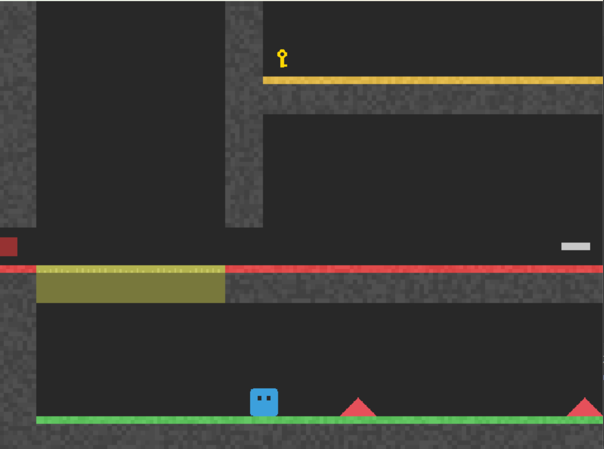
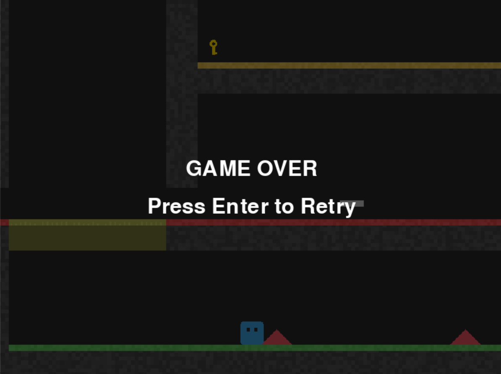

<div align="center">

<h1>マトリックスキューブ</h1>


</div>

<h2>ゲームの概要</h2>

 マトリックスキューブがあらゆる障害物をよけながら鍵を入手し、ゴールを目指すゲーム

<h2>実行環境</h2>

1. Python3

    このコードは基本的な構文のみを使用しているためPython3.7以降のバージョンであれば問題なく動作します

2. Pygameライブラリ

    Pythonのインストール後に以下のコマンドを実行するだけでインストールできます

    ```bash
    pip install pygame
    ```

<h2>プレイ画面</h2>





<h2>ゲームの遊び方</h2>

* wasdでこうかとんを操作し、スペースでジャンプ
* 障害物にあたったらゲームオーバー(ゲームオーバー時にEnterキーでやり直し可能)
* 鍵をとってゴールすればクリア

<h3>ToDo</h3>

- ボス戦(落下してくるとげを避けきるなど)
- 複数のステージの追加(高難易度ステージなど)


<h3>追加機能:壁キック 担当者:c0a24191</h3>

1. 壁キック (Wall Kick)

    機能: プレイヤーが空中で壁に張り付いている状態でジャンプボタンを押すと、壁と反対側の斜め上に飛び出す。

    効果:プレイヤーは壁を使いジャンプできるようになる

2. 壁ずり落ち (Wall Slide) 

    機能: 空中で壁に張り付いている間、プレイヤーの落下速度が遅くなり、壁をゆっくりと滑り落ちるようになる。

    効果: これにより、プレイヤーは壁に張り付いたまま、タイミングを計って壁キックを実行できる。

3. 壁キッククールダウン (Cooldown) 

    機能: 壁キックを実行した直後のごく短い期間（約10フレーム）、左右の移動入力を一時的に無視する。

    効果: 壁キックで設定した壁と反対方向への勢いを、プレイヤーの移動入力がすぐに上書きしてしまい、壁に戻ってしまう現象を防ぎ、安定した動作を保証する。

<h3>追加機能:重力反転、速さとジャンプ力を上げる床 担当者:c0a24159</h3>

1. 重力の上下反転 (GravitySwitcher) 

    機能: 紫色のブロックを取得すると、アニメーションが入って画面が上下さかさまになる。 

    効果: 操作方法は元の重力のままであるため、直感的な操作ができなくなる。

2. 速度、脚力増強床 (BoosterPlatform) 

    機能: 特定の床に乗っていると、ジャンプ力や速さが強化される。 

    効果: ステージギミックとして、よりゲームに深みを出す。

<h3>追加機能:とげ 担当者:c0a2406385</h3>

1. 落下してくるとげ

    機能: ある地点に行くと上からとげが落下してくる。

    効果: ステージギミックとして、よりゲームに深みを出す。

2. 移動するとげ

    機能: 地面に移動してくるとげを配置した。

    効果: ステージギミックとして、よりゲームに深みを出す。

<h3>追加機能:弓矢 担当者:c0a2405503</h3>

1. 飛んでくる矢

    機能: どこからか弓矢が飛んでくる。

    効果: ステージギミックとして、よりゲームに深みを出す。

<h3>追加機能:物理演算、コース調整、キャラクター生成、ゲームオーバー画面 担当者: c0a24091</h3>

1. 物理演算

    機能: 接地しているときに滑るようにした

    効果: ユーザーのアクション体験が豊かになる

2. コース調整

    機能: クリア可能な難易度にした

    効果: ユーザーのストレス軽減

3. キャラクター生成

    機能: 鍵や主人公のイメージを作成した

    効果: ゲームらしさの向上

4. ゲームオーバー画面

    機能: ゲームオーバーしたときEnterキーを押すことでやり直せるようにした

    効果: ゲームらしさの向上


